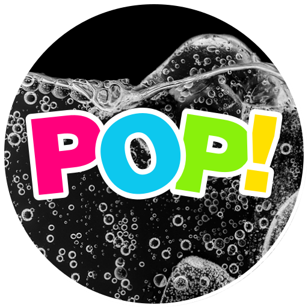
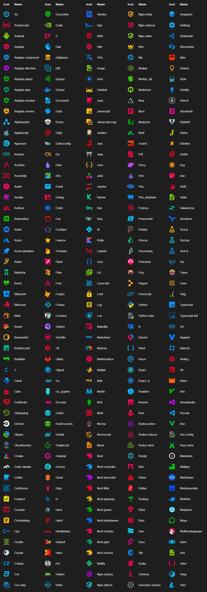
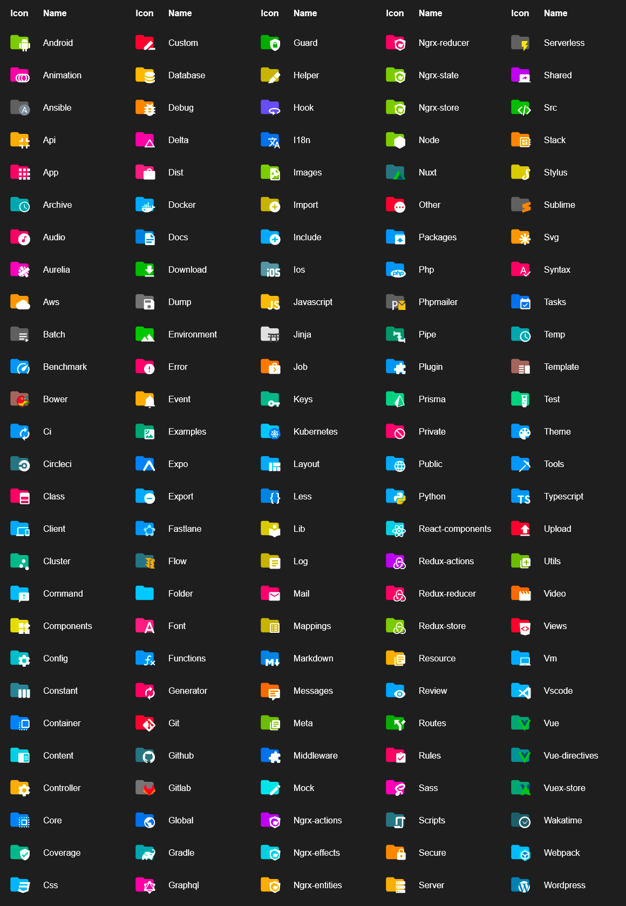
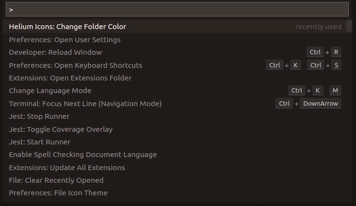
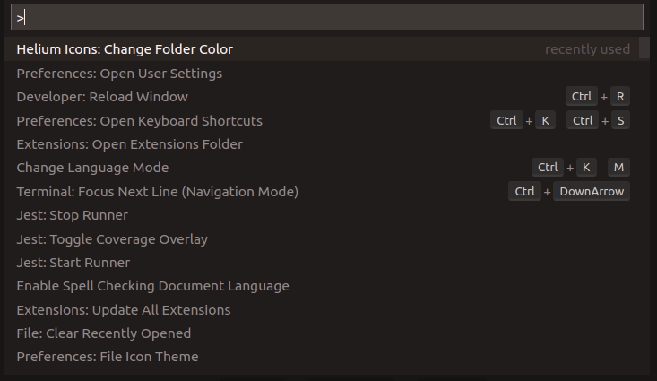
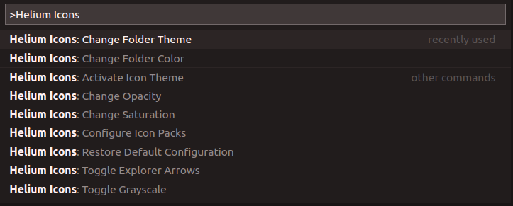

# POP! Icon Theme
<div align="center">

</div>

Based off of the Helium Icons extension with extensive code cleanup, slight restyling, and extended customization abilities.

### File icons



### Folder icons



#### Customize folder color

You can change the color of the default folder icon using the command palette:



or via user settings:

```json
"pop-icon-theme.folders.color": "#ef5350",
```

#### Folder themes

You can change the design of the folder icons using the command palette:



or via user settings:

```json
"pop-icon-theme.folders.theme": "specific"
```

## Custom icon opacity

You can set a custom opacity for the icons:

```json
"pop-icon-theme.opacity": 0.5
```

## Custom icon saturation

If colors do not make you happy you can change the icons to have less saturation making them look grayish or completely grayscale by setting saturation to 0:

```json
"pop-icon-theme.saturation": 0.5
```

## Custom icon associations

You can customize the icon associations directly in the user settings.

### File associations

With the `*.[extension]` pattern you can define custom file icon associations. For example you could define an icon for `*.sample` and every file that ends with `.sample` will have the defined icon. Use `**.[extension]` with two asterisks to apply the file association also for the filenames ending with that file extension.

If there's no leading `*` it will be automatically configured as filename and not as file extension.

```json
"pop-icon-theme.files.associations": {
    "*.ts": "typescript",
    "fileName.ts": "angular"
}
```

### Folder associations

The following configuration can customize the folder icons. It is also possible to overwrite existing associations and create nice combinations. For example you could change the folder theme to "classic" and define icons only for the folder names you like.

```json
"pop-icon-theme.folders.associations": {
    "customFolderName": "src",
    "sample": "dist"
}
```

### Language associations

With the following configuration you can customize the language icons. It is also possible to overwrite existing associations.

```json
"pop-icon-theme.languages.associations": {
    "languageId": "iconName",
    "json": "json"
}
```

Available language ids:

https://code.visualstudio.com/docs/languages/identifiers#_known-language-identifiers

You can see the available icon names in the overview above.

## Commands

Press `Ctrl-Shift-P` to open the command palette and type `Pop Icons`.



| Command                           | Description                                                                        |
| --------------------------------- | ---------------------------------------------------------------------------------- |
| **Activate Icon Theme**           | Activate the icon theme.                                                           |
| **Change Folder Color**           | Change the color of the folder icons.                                              |
| **Change Folder Theme**           | Change the design of the folder icons.                                             |
| **Change Opacity**                | Change the opacity of the icons.                                                   |
| **Change Saturation**             | Change the saturation value of the icons.                                          |
| **Configure Icon Packs**          | Select an icon pack that enables additional icons (e.g. for Angular, React, Ngrx). |
| **Hide Folder Arrows**            | Hides the arrows next to the folder icons.                                         |
| **Restore Default Configuration** | Reset the default configurations of the icon theme.                                |
| **Toggle Grayscale**              | Sets the saturation of the icons to zero, so that they are grayscale.              |

## Icon sources

- [Material Design Icons](https://materialdesignicons.com/)
- official icons

Based off of the original [Material Icon Theme](https://marketplace.visualstudio.com/items?itemName=PKief.helium-icon-theme)
